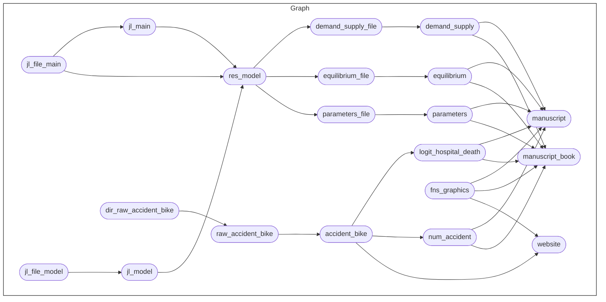

# {targets} に身を任せろ

[`{targets}`](https://books.ropensci.org/targets/)は, 研究のワークフローを構築するRのパッケージです. 最大の特徴は, データ, 関数, 結果をRのオブジェクトとしてその依存関係を管理し, 上流のオブジェクトが変更されたときに, それに依存する下流のオブジェクトを自動的に再計算してくれることです. これにより, 再現性を保ち続けたまま研究を進めることができます.

さらに[Quarto](https://quarto.org/)と組み合わせることで, 研究途中のレポートやスライド, 論文の執筆といった, 研究の全てのワークフローを一つのパイプラインで管理することができます.　この記事では以下のQuarto + {targets}を用いた研究のワークフローを解説します. 実際に私が研究で用いており, 研究の進捗に合わせてステップを進めていくことができるようになっています. また, 研究とは直線的なものではなく, 試行錯誤を繰り返しながら道を見つけていくものだと思います. そのため, 論文を執筆し始める前の試行錯誤の段階に, ある程度の自由度を持たせています.

コードは以下のリポジトリにあります. コードやディレクトリ構成など参考にしてください.

https://github.com/kazuyanagimoto/quarto-research-blog/tree/main

## ワークフロー


1. `_targets.R` の初期設定を行う
1. データクリーニングを定義する `R/tar_data.R`
1. ウェブサイトを設定する `_quarto.yml`
1. データ分析やモデルの試行錯誤 `playground/yymmdd_*/index.qmd`
1. 途中結果をスライドにまとめる `slide/yymmdd_*/index.qmd`
1. 3-5を繰り返す. 主要な結果をパイプラインに組み込む `R/tar_fact.R`, `R/tar_model.R`
1. 最終的な結果で論文を執筆する `manuscript/*.qmd`

論文を執筆しおわった頃には以下のようなパイプラインができあがっているはずです. これは `targets::tar_mermaid()` で生成したものです.



次章ではワークフローの各部分を解説していきますが, その前に`{targets}`の基本的な使い方を解説します.

## {targets} の基本

`{targets}`の基本を学ぶには公式の[チュートリアル](https://books.ropensci.org/targets/)ですが, 実用上は`{targets}`を拡張した`{tarchetypes}`の文法を使うことが多いです. そのため, ここでは`{tarchetypes}`の文法に基づいて最低限の使い方を解説します. この`{targets}`から`{tarchetypes}`への移行に関してはこの[チュートリアル](https://carpentries-incubator.github.io/targets-workshop/index.html)が参考になりました.

### 基本の3つの要素

`{targets}`の哲学は, 研究のワークフローを三つの要素に分けて考えることです. それは, **ファイル**, **関数**, **オブジェクト** です.

- **ファイル**: `tar_file()`で定義される, ファイルのパス名を持つオブジェクト. ファイルのサイズやタイムスタンプも保存されているため, ファイルのパスが変更されていなくても, ファイルの中身が変更されていれば, 依存するパイプラインが再計算される
- **オブジェクト**: 変数やデータフレームなどのRのオブジェクト
- **関数**: Rの関数. ただし, インプットには依存する全てのオブジェクトを指定する必要があり, アウトプットがファイルまたはオブジェクトである必要がある. これにより, 依存関係を明示的にすることができる

イメージとしては, ファイルから始まり, それを読み込んでオブジェクトを作成し, そのオブジェクトを使って関数を実行して新しいオブジェクトを作成するという流れです. これらの要素は, `tar_plan()`の中で定義されます.

```r:_targets.R
clean_data1 <- function(data1_raw) {
  data1_raw |>
    filter(!is.na(col1))
}

tar_plan(
  data1_raw_file = tar_file("path/to/file/data1.csv"),
  data1_raw = readr::read_csv(data1_raw_file),
  data1_cleaned = clean_data1(data1_raw),
)
```

上の例では, `data1_raw_file`がファイル, `data1_raw`と`data1_cleaned`がオブジェクト, `readr::read_csv`と`clean_data1()`が関数です.

### 実行と依存関係の管理

定義したパイプラインは, `targets::tar_visnetwork()`で可視化することができます.


ここでは三角形が関数, 丸がファイルとオブジェクトを表していることがわかります. また, パイプラインが実行されていない状態が水色で表されています. ここで, `targets::tar_make()` を実行すると


正常に実行されると, 実行された部分がグレーに変わります. ここで, `data1.csv` (`data1_raw_file`) の中身を変更すると,


依存関係のある部分が未実行状態に戻ります. もちろん, `targets::tar_make()`を実行すると, 依存関係のある部分が再計算されます.


さらに, `clean_data1()` の中身を変更すると, 以下のようになります.


このように, `tar_plan()` 上でパイプラインの定義をし, `tar_make()` で実行するという流れを繰り返していくのが `{targets}` の基本的な使い方です.

# Quarto + {targets} のワークフロー

## 1. `_targets.R` の初期設定を行う

https://github.com/kazuyanagimoto/quarto-research-blog/blob/main/_targets.R

重要なのは以下の3つです.

### `tar_source()`

パイプラインで使用する関数のソースコードのあるディレクトリを指定します. デフォルトでは`R/`ディレクトリが指定されています

### `tar_plan()`

パイプラインの定義を行います. 全てのパイプラインをここに記述する必要はなく, `tar_source()` で読み込まれるファイルの中でパイプラインを定義してそれを呼び出しても構いません. 例えば `data` というパイプラインは `R/tar_data.R` の中で以下のように定義されています.

https://github.com/kazuyanagimoto/quarto-research-blog/blob/main/R/tar_data.R

### `here_rel()`

`here::here()`は, プロジェクトのルートディレクトリを基準にした相対パスを指定するための関数です. これを使うことで, プロジェクトのルートディレクトリが変更されても, パスを変更する必要がなくなります. ただし, `_targets.R` の中で `here::here()` を使うと, 絶対パスが保存されてしまい, 他者と共有した場合に問題が発生します. そのため, `here::here()`の利便性を保ちつつ, 相対パスで保存できる関数を使用しています. この部分は Andrew Heiss さんの[コード](https://github.com/andrewheiss/lemon-lucifer/blob/main/_targets.R) を参考にしています.

## 2. データクリーニングを定義する

データクリーニングのパイプラインを定義します. 詳しくは以下のコードを参照してください.

https://github.com/kazuyanagimoto/quarto-research-blog/blob/main/R/tar_data.R

ポイントとしては

- rawデータのファイルは `tar_file()` で定義する
- rawデータの読み込みは, `readr::read_csv()` などの関数を使う
- クリーニングの関数は, rawデータを引数に取り, クリーニング後のデータを返す

という工程を必ず踏むことです. また上記の最初の二つを統合して

```r
tar_plan(
  tar_file_read(
    data1_raw,
    here_rel("path", "to", "file", "data1.csv"),
    readr::read_csv(!!.x),
  ),
  data1_cleaned = clean_data1(data1_raw)
)
```

といった書き方もできます. またオンライン上のファイルをダウンロードして `tar_file` で定義したい場合,

```r
download_file <- function(url, destfile) {
  if (!file.exists(destfile)) {
    download.file(url, destfile)
  }
  return(destfile)
}
```

といった関数を定義して, `tar_file()` の中で呼び出すことができます. 保存先のパスを返す関数を定義するというのがポイントです.

また私自身のデータクリーニングにおける考え方は以下の記事にまとめてあります.
https://zenn.dev/nicetak/articles/r-tips-cleaning-2022


## 3. ウェブサイトを設定する

ウェブサイトをパイプラインの中でビルドするには `tar_quarto()` を用います. ウェブサイトを用いる意味や具体的な設定は以下の記事を参考にしてください.
https://zenn.dev/nicetak/articles/quarto-research-blog

## 4. データ分析やモデルの試行錯誤

上記で設定したウェブサイトの`plyaground`ディレクトリの中でノートブック形式のポストを作成し, データ分析やモデルの試行錯誤を行います.

データクリーニングを行なった後のデータを `tar_load()` で読み込むことができます. また図などの設定は, `R/fns_graphics.R`内で定義していて, それを読み込む形で使用しています.

https://github.com/kazuyanagimoto/quarto-research-blog/blob/main/posts/240324_accident_bike/index.qmd#L21-L39

ポイントとしては, 必要以上にパイプラインに組み込まないことです. 試行錯誤の段階のほとんどの分析は実際の論文には含まれません. そのため, それをパイプラインに組み込むと, ほとんど必要ないにも関わらず, 依存関係の管理が難しくなります. そのため, `playground` ディレクトリの中で試行錯誤を行い, 最終的に必要なものだけをパイプラインに組み込むようにしています.

`tar_quarto()`とQuartoの`freeze: auto`の設定をを組み合わせることで, 一度コンパイルした結果は, 手動でコンパイルしない限り, 再計算されません. パイプラインの上流が変更された場合でもそれに依存する部分が再計算されないというデメリットはありますが, 不必要な部分の管理をほとんどしなくても良いというメリットがあります. 上流で変更があった場合には, プロジェクトの中で必要な部分だけを手動でコンパイルし直せば良いです.

## 5. 途中結果をスライドにまとめる

研究を進める中で, 途中結果をプレゼンする機会はよくあると思います. 試行錯誤した中で, 重要な結果をスライドにまとめるという形式が良いと思います. この段階も試行錯誤の過程の一つと考えるので, それをパイプラインに組み込む必要はありません. このプロジェクトでは, `slide`ディレクトリもウェブサイトのページの一部としてコンパイルされます.

私はスライドは, [Quarto Clean Theme](https://github.com/kazuyanagimoto/quarto-clean-typst) で作成しています. Quartoで作成されるため, このワークフローに自然に取り込むことができます. また, Typstを用いているため, Beamerなどと比べて高速にコンパイルされます. 以下の記事ではスライドの作成方法について詳しく解説しています.

https://zenn.dev/nicetak/articles/quarto-typst-slides

## 6. 3-5を繰り返す. 主要な結果をパイプラインに組み込む

プレゼンなどでフィードバックをもらいながら, 研究を進めていきます. 論文の執筆に十分な結果が得られたら, 次のステップに進みます. ここで初めて, `R/tar_fact.R` や `R/tar_model.R` などのパイプラインを定義していきます.

### 主要な結果をパイプラインに組み込む

https://github.com/kazuyanagimoto/quarto-research-blog/blob/main/R/tar_fact.R

論文に必要な数値をパイプラインに組み込みます. 私は, `compute_*()` という関数を定義して, クリーニングされたデータを引数にとり, 計算した結果を数値あるいはデータフレームとして返すようにしています. 図表の作成は論文中の中で行うので, ここでは行いません.

LaTeX等で執筆される方は, この段階で図表を保存すると良いと思います. 例えば以下のようなパイプラインが考えられるでしょう.

```r
tar_plan(
  tar_file(
    fig1_file,
    plot_fig1(data1, here_rel("path", "to", "file", "fig1.pdf"))
  )
)

plot_fig1 <- function(data1, path_fig1) {
  ggplot(data1, aes(x = col1, y = col2)) +
    geom_point()
  
  ggsave(path_fig1)
  return(path_fig1)
}
```

### Juliaのコードをパイプラインに組み込む

Rの分析だけであれば, そのままパイプラインに組み込むことができますが, Juliaのコードを組み込む場合は少し工夫が必要です. 私は以下の方法を取っています.

1. Juliaのソースコードファイルとして読み込み `tar_file_read()`, パイプラインに組み込む `jl_file_*`
1. JuliaのソースコードをRの`system2()`でコマンドライン実行する `run_model()`
1. Juliaの中で実行される結果は, CSVやYAMLなどのファイルとして保存しておき, Rの中で読み込む `tar_file_read()`

https://github.com/kazuyanagimoto/quarto-research-blog/blob/main/R/tar_model.R

ポイントとは以下の2点です.

1. Julia内の依存関係も含められるように, `run_model()` の引数に全ての依存関係を指定する
1. 結果を保存したファイルは, リストにまとめた上で, Rから一つずつ読み込む


ちなみに, `system2()`で実行する場合, Juliaのパスが通っていないことがあります (PCのデフォルトのシェルとRのシェルが異なるため). その場合は, `.Renviron` で定義したJuliaのパスを

```shell:.Renviron
PATH_JULIA=/path/to/julia/
```

`.Rprofile` で読み込むようにしています.

https://github.com/kazuyanagimoto/quarto-research-blog/blob/main/.Rprofile

## 7. 最終的な結果で論文を執筆する

論文の執筆は, `manuscript` ディレクトリの中で行います. ここでは, 上記で定義したパイプラインの実行結果を`tar_load()` で読み込んで, 論文を執筆します. 私は以下の3ステップで論文を執筆しています.

1. `manuscript/_quarto.yml` でディレクトリ自体を[Quarto Book](https://quarto.org/docs/books/)として設定する
1. Quarto Bookとして執筆する `01-intro.qmd`, ...
1. `manuscript/main.qmd` に `01-intro.qmd`, `02-methods.qmd`, ... をまとめて (``) コンパイルする

### なぜQuarto Bookとして執筆するのか

Quarto Book として執筆すると, 複数ファイルに分けても, cross-reference が効きます. これはかなり便利で, セクションごとにファイルを分けることで論文の構造が把握しやすくなり, cross-reference の入力補完が働くことで, 快適に執筆できます.

ただし, Quarto Bookは出力形式としては論文に相応しくないので, それらのファイルをまとめて, `manuscript/main.qmd` でコンパイルしています.

https://github.com/kazuyanagimoto/quarto-research-blog/blob/main/manuscript/main.qmd#L61-L75

この時, バックエンドは高速でコンパイルできるTypstを使用しています. またテンプレートは [quarto-academic-typst](https://github.com/kazuyanagimoto/quarto-academic-typst) を使用しています.　ちなみにLaTeXのソースコードが必要になった場合は, `quarto::quarto_render()`でLaTeXのソースコードを生成することができます (私は, 博士論文の執筆の際, LaTeXテンプレートに合わせるために使用しました).


### LaTeXで執筆する場合

LaTeXで執筆する場合も`TinyTeX`を用いてコンパイルするならば, パイプラインに組み込むことができます. 例えば以下のような形が考えられるでしょう. ただし, 実際には全ての図表の依存関係を入れる必要があると考えられます.

```r
tar_plan(
  tar_file_read(
    manuscript,
    here_rel("manuscript", "main.tex"),
    readLines(!!.x)
  ),
  tar_file(
    manuscript_pdf,
    compile_latex(manuscript, here_rel("manuscript", "main.pdf"))
  )
)

compile_latex <- function(manuscript_file, path_pdf) {
  tinytex::xelatex(
    manuscript_file,
    output = path_pdf
    pdf_file = path_pdf
  )
  return(path_pdf)
}
```

# おわりに

Quarto + `{targets}` を用いた研究のワークフローについて解説しました. `{targets}` は最初はやや難しいかもしれませんが, `{targets}` に身をまかせ, `{targets}` が実行できる状態を保つことで, 再現性に関してクリーンな状態を保ことができます. 結果的には, 研究をより効率的に進めることができるはずです.

Happy Quarto + {targets} Life! 🥂